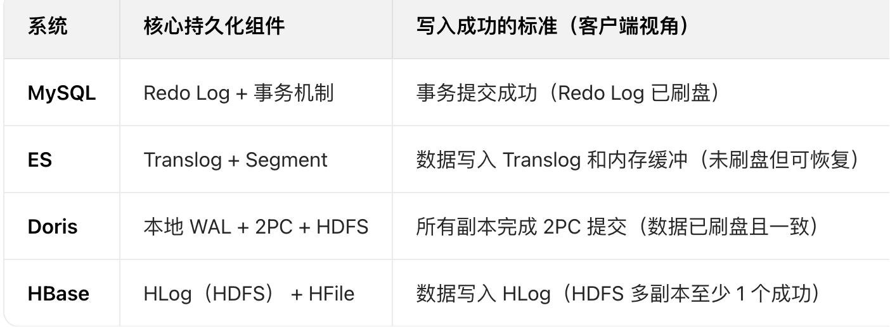

### 基础原理
1. 存储原理。
        1. MySQL是关系型数据库，基于B+树索引，数据**按行存储**，支持ACID事务。
        2. ES是基于Lucene的搜索引擎，使用倒排索引，数据分片，按**文档存储**，适合全文检索。
        3. Hive是数据仓库，基于HDFS，数据按表分区按**文件存储**，本质是Hadoop的SQL接口，查询/计算延迟高。
        4. Doris是MPP架构的OLAP数据库，采用**列式存储**，支持向量化执行，适合实时分析。
        5. HBASE 是NOSQL,基于HDFS的分布式**列存数据库** 存储原理是lsm 存储。
        6. clickhouse 也是 **列式存储**
        7. mongodb 使用的是基于B树的 json型存储的NoSql。
2. 存储结构
        1. MYSQL 是B+ 树索引（聚簇索引，数据与索引绑定）
        2. ES 是 倒排索引（全文检索核心）+ 列存储（Doc Values）
        3. DORIS 是 行存（实时数据）+ 列存（离线数据），支持分区 / 分桶 (存储是场景适配加速的：适合批量/一次性的导入,对大批量的数据进行处理成顺序写入)
        4. HBASE 是 列族（Column Family）+ RowKey 有序排列（LSM 树：MemStore + HFile， 适合高频的单行写入。）
3. 数据可靠性的保证
      1. MYSQL 是WAL（Write-Ahead Log）保证崩溃恢复
      2. ES 是 Translog（实时写入持久化）+ Segment（定期合并优化查询）
      3. DORIS 是 行存（实时数据）+ 列存（离线数据），支持分区 / 分桶
      4. HBASE 是 列族（Column Family）+ RowKey 有序排列（LSM 树：MemStore + HFile）
      5. 基于wal 和 多副本机制。
4. 事务类型
        1. MySQL是ACID 强事务（行级锁），适合OLTP，如交易系统
        2. es 仅支持文档级原子性（无跨文档事务）
        3. hive 不支持事务（仅批量写入）
        4. doris 支持弱事务（批量写入原子性）
        5. oceanbase 支持事务，兼容mysql协议
5.写入方式 /读取方式
        1. MYSQL 顺序写(主键插入) + 随机写(更新操作)   / 随机读（B+树索引）
        2. ES **近实时写**(倒排索引更新) / 全文检索（倒排索引）、**近实时读**
        3. HIVE 批量写 (HDFS 追加写) / **离线读**（MapReduce/Spark）
        4. DORIS **批量实时写**（列式存储）/ **实时聚合读**（向量化执行)
        5. HBASE 顺序写（先写 WAL，再更新MemStore，再刷写 HFile）/ **实时读**（RowKey 精准定位)
6. 存储价格(影响因素： 计算配置cpu和内存 + 存储配置hdd还是ssd + 数据压缩能力)
        1. mysql(实例配置cpu和内存 + 存储容量)，0.8 元 / GB / 月
        2. redis(内存是核心)， 
        3. oss(存储容量)
        4. es(主节点(管理集群)+协调节点(路由) + 数据节点(存储+计算)
        5. hbase(计算节点(regionServer) + 存储节点(hdfs))
        6. doris(FE 节点（元数据 / 查询规划）+ BE 节点（数据存储 / 计算）)
7. 存储介质的种类和价格
        1. Optane SSD > NVMe SSD > SATA SSD > SAS HDD > SATA HDD > 对象存储
        2. 参数主要有：随机读延迟 0.1-0.3ms，随机写延迟 0.5-1ms；IOPS 可达 150 万 +（4K 块），带宽 2-4GB/s。
        3. 业内最佳实践：
             3.1. 热数据优先选 NVMe SSD：性能足够支撑万级 QPS，价格比 Optane 亲民，是目前性价比最高的热数据存储。
             3.2. 温数据选 SATA SSD/SAS HDD：平衡性能与成本，适合 3-12 个月、中等频次访问的数据。
             3.3. 冷数据选 SATA HDD / 对象存储：SATA HDD 适合需要偶尔快速查询的冷数据，对象存储适合极低访问频次的归档数据。
             3.4. 成本敏感场景优先对象存储：超大规模冷数据（10PB+）用对象存储，成本比 HDD 低 50% 以上。
8. 适用场景：
        1. hive是数据仓库，设计目标是处理大规模结构化 / 半结构化数据的离线分析，而非实时读写。
        2. hbase 是分布式、面向列的 NoSQL 数据库，支持高并发实时读写、随机访问，适合处理 非结构化 / 半结构化数据的 ** 在线业务 **。
        3. redis VS hbase
                redis： 适合 “小数据量、高频访问、低延迟” 场景
                HBase： 适合 “海量数据、写多读少、查询模式简单" 场景 (用户行为日志，时序数据存储，明细数据存储，用户画像)

### 关键差异
MySQL：基于 B+ 树的行式存储，适合结构化数据的随机读写，依赖磁盘 IO 和事务锁机制。
ES：基于 Lucene 的倒排索引（词到文档的映射），适合全文检索；正排索引（文档到字段）用于快速查询，数据分片分布式存储。
Hive：本质是 Hadoop 的 SQL 语法层，数据存储在 HDFS（分布式文件系统），通过元数据管理表结构，计算时转换为 MapReduce/Spark 任务。
Doris：MPP（大规模并行处理）架构，列式存储（压缩率高、适合聚合查询），支持实时写入和高效分析。

### 数据模型 
1. MySQL关系型（行式存储）
     (强 Schema（预定义列、类型、约束）)
     数据以二维表（Table）形式组织，行（Row）代表记录，列（Column）代表字段；严格遵循关系模型（实体-关系）。
2. Doris关系型（列式存储 + MPP 架构）
     (强 Schema（预定义列、类型、约束）)
    2.1. 数据以表（Table）形式组织，但采用列式存储（Columnar）；支持星型/雪花模型，优化多维聚合查询。
    2.2. 全量table -> partition(按时间分区) -> 
     
3. Hive 关系型（基于 HDFS 的表存储）
     (强 Schema（预定义列、类型、约束）) 
     数据以表（Table）形式组织，结构与传统关系型数据库一致；数据存储在 HDFS（分布式文件系统），依赖分区（Partition）和分桶（Bucket）优化查询。
4. ES 非关系型 (文档型)
     (推荐强Schema 为主，支持动态扩展。允许文档动态添加未预定义的字段，无需提前声明)
     4.1. 数据以 JSON 格式的文档（Document）存储，无固定 Schema（字段可动态扩展）；强调文档的独立性与全文检索能力。(索引类似table， document 类似row， 字段类似column)
     4.2. 索引中包含全量数据，但是为了性能，一般不会把表中全部数据都存储到索引中， 所以一般会对索引进行按时间范围划分， 过时重建。
5. HBASE 非关系型 (面向列的kv)
    (弱 Schema（仅预定义列族，列动态扩展))
    5.1. HBase 中有表和行的概念，但与传统关系型数据库有本质区别： 表是逻辑容器，仅预定义列族，支持动态扩展列； 行由 RowKey 唯一标识，数据稀疏存储，无固定列结构。
    5.2. 全量table -> region(对表进行分区)。  表数据量过大后，会自动进行再分区扩容。 
6. mongodb 非关系型(文档型)
   (弱schema，无需提前声明格式，直接存储就可以)
    6.1. 索引结构类似mysql，需要提前声明，开销比mysql还要高一点点

### 原公司生产环境性能表现
1. hbase， 查qps为7k左右， 耗时约为1ms左右

### 增删查改
1. mysql/doris/hive 
     都走select，update，insert，delete。
2. es
     增：PUT方法api， 删：DELETE方法api， 查：GET方法api， 改： POST方法部分更新/PUT方法全量更新
     DSL Query的分类(es提供了基于json的DSL)
        1. 查询所有 (一般测试用，match_all)
        2. 全文检索 (类似mysql的like查询。会对用户输入内容分词，后使用倒排索引查询。常用于搜索框查询 单字段查询：match；多字段查询: mutli_match )
        3. 精确查询 (类似mysql的普通查询。不进行分词，全匹配查询。term进行匹配查询， range进行范围查询) 
        4. 复合查询 (类似mysql的查询组合and/or。复合查询可以将其它简单查询组合起来，实现更复杂的搜索逻辑  and查询：must /  or查询：should  / 非查询：must_not, filter) 
        5. 地理查询 (矩形查询， 中心原点范围查询)
     结果排序分页
        1. 排序order：默认根据相关度算分来排序。可以排序的字段有：keyword类型，数值类型，日期类型，地理坐标类型
        2. 分页(默认top10)：from=990,size=10, 将所有结果在内存中聚合排序，选出10条数据。因为是在内存中，所以es设定结果集的查询上限是1w条。
3. hbase
    主要通过 HBase Shell 或 Java API 操作，核心是 RowKey 和 列族
    增/改：(put 'user', '1', 'info:name', 'Alice') 语法：put 表名, RowKey, 列族:列限定符, 值 
    删：   (delete 'user', '1', 'info:name') 语法：delete 表名, RowKey, 列族:列限定符 / deleteall 表名, RowKey
    查：   (get 'user', '1') (scan 'user', {ROW_STARTKEY => '1', ROW_STOPKEY => '3'}) 语法： get 表名, RowKey 或 scan 表名
     

### 数据仓库 VS 数据湖
1. 数据仓库是格式化的数据，经过处理后的数据； 数据湖是原始数据，未经过处理，目标是保存各种原始数据。

### LSM树 (log structed merge 存储结构)[LSM](https://zhuanlan.zhihu.com/p/181498475)
> 基础流程是 “写 WAL（日志）→ 写内存缓冲 → 异步刷盘生成磁盘文件 → 后台合并文件”
> 核心特点是利用顺序写来提高写性能，但因为分层的设计会稍微降低读性能(需要进行Compact操作(合并多个SSTable)来清除冗余的记录。)
2. B+树数据写入时，如果是自增主键，那么也是顺序写(如果是自定义主键就是随机写，不推荐)。 更新时会直接在原数据所在处修改对应的值，写随机写。
3. 但是LSM数的数据更新是日志式的，当一条数据更新是直接append一条更新记录完成的，LSM树会将所有的数据插入、修改、删除等操作记录(注意是操作记录)保存在内存之中，当此类操作达到一定的数据量后，再批量地顺序写入到磁盘当中。
   因此当MemTable达到一定大小flush到持久化存储变成SSTable后，在不同的SSTable中，可能存在相同Key的记录，当然最新的那条记录才是准确的。

- LSM树有以下三个重要组成部分：
1. MemTable是在内存中的数据结构，用于保存最近更新的数据(当写数据到memtable中时，会先通过WAL的方式备份到磁盘中，以防数据因为内存掉电而丢失。)
2. Immutable MemTable是将转MemTable变为SSTable的一种中间状态（memtable满了后就会进行这个阶段）
3. SSTable(Sorted String Table)有序键值对集合，是LSM树组在磁盘中的数据结构。  (数据结构：k-v-k-v-k-v)

### LSM tree 引擎是如何工作的：(https://zhuanlan.zhihu.com/p/704709264)
1. 写入操作是先写入内存的。所有的用于加速查询的数据结构（布隆过滤器和稀疏索引）都会被同时更新；
     1.1. 写入的数据可能是任意顺序的，但写入操作会先把数据存储到红黑树中，直至红黑树的大小达到了预先定义的大小。一旦红黑树的大小达到阈值，就会把数据整个刷到磁盘中，这个过程就可以把数据保证有序写入了。
2. 当内存中的 memtable 太大了，将会被刷到磁盘中，注意是有序的；
3. 当查询时我们先回查询布隆过滤器，如果布隆过滤器返回说键不存在，则实际不存在，如果布隆过滤器说存在，进一步遍历 segment 文件；(防止没有进行空查询)
4. 对于遍历 segment 文件的过程，我们将会先通过稀疏索引找到最小的文件范围，并开始由新到老开始遍历，找到一个key则直接返回。
5. es，hbase， oceanbase都采用lsm的思想

### lsm的读写放大问题
1. LSM-Tree 天生存在读写放大问题，根源是 “分层存储 + Compaction 合并机制”—— 写放大源于数据多次重写，读放大源于多版本 / 多层级数据遍历，
2. 解决思路是通过 “合并策略优化、存储硬件适配、索引过滤增强” 三维度降低放大比例
       Leveled Compaction（如 OceanBase、RocksDB）：按层级合并，同一层级 SSTable 数据无重叠，读放大小，但写放大中等。
       Size-Tiered Compaction（如 HBase）：按文件大小合并，写放大小，但同一层级 SSTable 重叠多，读放大高。
3. 核心权衡：读写放大无法完全消除，需根据业务场景取舍（写密集业务优先降低写放大，读密集业务优先降低读放大）。

### oceanbase 也采用了lsm的思想，怎么解决lsm的问题
1. 分层存储 + 冷热分离：
   Level 0~1 存储热点数据（SSD 高性能层），Level 2+ 存储冷数据（可挂载 HDD），合并时优先处理热点层，减少 IO 开销。
2. Compaction优化
   支持多线程、多分片并行合并，避免单线程合并成为瓶颈，尤其适合超大规模数据场景。
   限流与错峰，Compaction合并时动态调整 IO 带宽，避开业务高峰（如电商促销），减少合并对在线事务的性能影响。
   合并期间性能下降不超过 10%, 远优于原生 LSM-Tree（合并时性能可能下降 30%+
3. 墓碑机制优化删除：
   删除操作不直接物理删除数据，而是写入 “墓碑标记”，合并时才清理无效数据，避免实时删除的 IO 损耗。
4. MVCC 与 LSM 结合：
   通过版本号隔离读写，合并过程中不阻塞查询，解决原生 LSM 合并时的读阻塞问题。

### doris 和 es 一样都擅长处理批量数据，但没有采用lsm思想，怎么处理大量数据的写入的
> ES 聚焦实时全文检索与动态文档场景，必须面对 “高频、异构、需快速索引” 的写入需求，
> Doris 聚焦离线批量分析场景，数据 “结构固定、可预排序、允许导入延迟”
> ES 的数据是持续、高频产生的（每秒数千到数万条），且多为小批量写入（每条或几十条文档），而非 Doris 擅长的 “每小时 / 每天一次的百万级批量导入”。
1. 导入前预排序，直接写入大文件（“先整理”成有序的，进行顺序写，吞吐量更大）
2. 列式存储 + 压缩：降低 IO 压力，提升写入效率
3. Doris 的写入流程（即使是单行写入）会触发一套为 “批量场景” 设计的重量级流程，导致单行写入的延迟高、吞吐量低。 同时存储结构会导致“碎片化灾难”。

### redis 怎么实现存储的
1. redis 使用的是内存存储，8种数据结构都存储在内存中。 磁盘存储仅为数据可靠性服务
2. mysql 使用b+树的方式存储在磁盘中，实现快速访问。  hbase 使用lsm的方式存储在磁盘中，实现快速存储和访问。

### es 和 hbase 都采用了lsm 思想，但 ES 的单条写入性能远不如 HBase
> 核心原因在于两者的 设计目标、写入流程中的额外开销、数据结构复杂度 存在本质差异 ——ES 核心是支撑 “全文检索与复杂查询”，
> 在写入环节引入了大量 HBase 不需要的 “重量级操作”，导致单条写入延迟更高、性能更一般。 “批量写入” 是平衡这些开销、最大化写入效率的最优解，
> hbase 是处理海量数据写多读少，主键快速查询的随机访问场景。
1. 最根本的原因:ES 的核心是倒排索引（支撑全文检索），而 HBase 的核心是有序 KV 存储（支撑 RowKey 查询），两者写入时的计算开销完全不在一个量级。
      1.1. 倒排索引是计算密集型：分词、倒排表构建依赖 CPU，单条写入需处理多个字段，耗时较长（毫秒级）。
      1.2. 有序KV是 IO 密集型：几乎无复杂计算，仅需内存排序和日志写入，耗时极短（微秒级）。
2. ES 和 HBase 对 LSM 树的 “应用策略” 截然不同。 
      2.1. ES为提升批量写入效率牺牲了单条性能(1.批量请求合并， 2.默认每 1 秒将内存中的文档刷盘生成一个 “Segment”，若单条写入，每次刷盘仅生成一个极小的 Segment，后续后台合并（Merge）时需频繁处理大量小文件，导致 IO 和 CPU 开销浪费)
      2.2. 后者则为支撑高并发单写做了极致优化。(1.异步刷盘, 2.写时生成新文件,读时合并旧文件，避免阻塞前台写， 3. hbase是内存满了才刷盘)

### es 和 hbase 的 可读性时机
1. HBase 是 面向随机读写的列式数据库，核心需求是 “快速定位单行数据”（通过 RowKey 索引），因此内存中的 MemStore 数据只需按 RowKey 排序，即可支持简单的随机读取，无需复杂的索引结构；
2. ES 是 面向全文检索的搜索引擎，核心需求是 “快速匹配符合条件的一批文档”（如关键词搜索、模糊匹配、聚合分析等），依赖于 倒排索引 的高效查询能力，而倒排索引的构建必须基于 Lucene 的 Segment 文件结构。
       2.1. 数据首先被写入 ES 分片（Shard）对应的 内存缓冲（In-Memory Buffer）。此时数据仅存在于内存中，尚未构建倒排索引，无法被检索到。
       2.2. 将内存缓冲中的所有数据，批量写入到磁盘上的 Segment 文件； 同时为这些数据构建 倒排索引； 至此，新写入的数据才正式 “可见”.

### es 和 oceanbase 的读性能逼近mysql(mysql是1-3ms， 其他是1-5ms)，原因：
ES 和 OceanBase 虽无 MySQL 的 B + 树 “单路径定位” 能力，但通过以下设计实现快速读取：
1. 减少无效 IO：ES 用倒排索引快速匹配，OB 用布隆过滤器 + Leveled 合并减少重叠文件，本质都是 “提前筛选，不做无用功”；
2. 多级缓存兜底：和 MySQL 一样，把热点数据 / 索引放在内存，避免磁盘 IO，这是所有存储 “快速读取” 的共性；
3. 适配自身定位：ES 优化全文搜索和多字段过滤，OB 优化分布式事务和海量数据扩展，针对性解决场景痛点。

### 稀疏索引 VS 稠密索引
1. 稠密索引，就是每一行都会进行索引
2. 稀疏索引，可能每隔一定行数才进行一个索引， 进行搜索时先定位到索引段内，再进行顺序搜索(依赖索引字段的有序性，不适合高频范围查询)。
    是用更小的索引体积，换取合理的查询性能，尤其适合数据量大、索引字段重复值少或有序的场景。

### 顺序写存在的问题
1. 一般进行顺序写，底层使用的都是不可变结构(doris, es 和 hbase都是)，需要进行compaction操作，减少数量，释放存储，提高检索效率。

### 数据可靠性的保证对比 mysql，es，doris，hbase
1. 均依赖预写日志（WAL）
       在数据写入最终存储前，先写日志到磁盘，确保崩溃后可恢复（MySQL 的 Redo Log、ES 的 Translog、Doris 的 WAL、HBase 的 HLog）。
2. 确认机制适配场景：
      MySQL/ Doris 追求 “强一致性”，成功响应意味着数据已持久化到mysql磁盘（或doris所有副本）；
      ES/ HBase 追求 “高吞吐 / 低延迟”，成功响应意味着数据已进入安全的恢复路径（日志已写），但可能尚未完全落盘。
3. 分布式场景依赖多副本： 
      Doris、HBase、ES 通过多副本冗余，避免单节点故障导致的数据丢失；
      MySQL 更多依赖主从复制实现高可用。
4. 对比表格： 

### 分布式方式对比
> 四者的分布式技术差异，本质是场景需求驱动的设计取舍：
Redis：为低延迟键值查询，采用 “去中心化哈希槽 + 异步复制”，牺牲强一致性换取性能和扩展灵活性；最终一致性
ES：为全文检索高可用，采用 “主从分片 + 集中式管理”，平衡检索实时性与集群稳定性；最终一致性
Doris：为复杂分析的原子性，采用 “集中式协调 + 2PC 提交”，牺牲写入吞吐量换取批量数据一致性；强一致性
HBase：为海量数据强持久化，采用 “依赖 ZK+Region 自动分裂”，牺牲查询灵活性换取存储扩展性和写入可靠性。强一致性

1. 分片，主从(主负责写， 从负责读)
     redis 使用hash槽进行 数据分片，每个主分片有多个从， 异步同步到从
     es。  指定一个索引有几个 数据分片，每个主分片有多个从， 异步同步到从。 
     doris  先制定partition，每个分区下指定bucket，每个bucket下有tablet， tablet 也是有主从之分， 主从通过2pc 强制同步
     hbase。 主动生成存储单元region分片， 每个主分片可以配置多个 从分片（从分片数量默认不开启)，从分片通过 异步复制 从主分片同步数据
2. 分片管理
     redis： 没有管理节点，所有主分片通过gossip协议通信
     es：    有管理节点，Master 节点维护全局元数据，Data 节点定期向 Master 汇报状态，协调节点负责请求分发。  有多个候选master，
     doris： 主 FE 统一协调集群(负责 SQL 解析、元数据管理、查询计划生成)，BE 被动执行 FE 下发的任务（如数据导入、查询计算）  FE 有主从之分。
     hbase:  依赖 ZK 实现分布式协调，HMaster 仅负责元数据管理，数据读写直接与 RegionServer 交互，典型的 “依赖外部协调 + 主从分工”。
3.  es， doris， hbase，oceanbase 都是支持pb级数据规模(1000GB = 1TB,  1000TB = 1PB).

### 数据结构与存储
1. hbase通过Region、Store、MemStore、HFile等组件实现分布式管理和高效读写。
     1.1. HBase 表会按 RowKey 范围自动拆分为多个Region。 当 Region 数据量达到阈值（默认 10-20GB），会自动分裂为两个新 Region，实现数据的水平扩展。
     1.2. 每个 Region 包含多个Store（与列族一一对应），即一个列族对应一个 Store
     1.3. 每个 Store 由两部分组成：MemStore：内存中的临时存储区，数据写入时先进入 MemStore。HFile：持久化到 HDFS 的磁盘文件，是 Store 中已刷盘的数据存储单元
2. ES 的索引必须拆分为 主分片（Primary Shard） 和 副本分片（Replica Shard），两者配合实现 “分布式扩展” 和 “高可用”：
     2.1. 每个 ES 分片对应一个 Lucene 索引，Lucene 通过 “内存缓存 + 磁盘文件” 的分层结构
     2.2. 为了安全，同一个索引的不同主分片必须在不同机器上。

### hbase 不适合小量级的数据存储(“适合 10 亿 + 数据” )
> 是为解决 “海量数据（PB 级）的高并发随机读写” 而生，数据量少的时候，其分布式架构的 “优势” 会反过来变成 “负担”。
> 核心原因可归结为架构开销、资源利用率、成本性价比、性能适配四个维度
1. 架构开销：分布式组件的 “最小成本” 远高于数据存储需求
      1. 1-3 个 Master 节点（负责 Region 分配、元数据管理，需高可用）；
      2. 至少 3 个 RegionServer 节点（负责实际数据读写，单机配置至少 8 核 16GB）；
      3. 3 个 ZooKeeper 节点（负责集群协调、Master 选举）；
      4. 底层依赖 HDFS 集群（至少 3 个 DataNode 节点）。
2. 资源利用率：Region 太少导致 “负载不均 + 算力浪费”
      1. HBase 的性能核心是 “Region 并行处理”，但数据量少时，Region 数量会极少.
      2. 相当于 “买了 3 台服务器，只用 1 台，另外 2 台吃灰”。
3. 成本性价比：远高于单机数据库 / 对象存储
4. 性能适配：查询灵活性差，反而不如单机数据库
     1. 查询方式单一：HBase 仅支持 “按 RowKey 精确查询” 或 “RowKey 范围扫描”，不支持复杂 SQL
     2. 小数据查询延迟高：HBase 的读写需经过 “Client→RegionServer→HDFS” 多节点交互，即使数据量小，网络往返、分布式协调的开销也比单机数据库（本地 IO）高 10 倍以上。
          例如：查询 1 条记录，PostgreSQL 耗时 1ms，HBase 可能耗时 10-20ms。

### mysql 的读写能力(正常命中索引的单表读情况下，读qps 是 写qps的5-10倍)
> 写入耗时瓶颈：磁盘io(日志刷盘、数据页和索引页写入) + 锁竞争
> 读耗时瓶颈：内存大小（缓存命中时）或 CPU（复杂计算时）
1.  低配置(4核8G)：   简单sql(无索引)  写：1k-2k
2. 次低配置(8核16G)： 简单sql(无索引)  写： 2k-5k
3.  中配置(16核32G)： 简单sql(无索引)  写：5k-1w
4.  高配置(32核64G)： 简单sql(无索引)  写：1w-2w
5. 最高，mysql单机qps 也不建议超过5万， 分库分表不超过50万

### mysql中字段数量对性能的影响
>单行数据体积越大，会通过 “数据页利用率”、“IO 次数”、“日志开销” 三个维度降低写入性能
> 单个数据页是16kb， 超过会写入新的数据页，多一次io操作。 写日志时还有带宽开销。
1. 少量字段（3-5 个）：写入性能最佳；
   中量字段（10-20 个）：性能下降 40%-60%，需通过垂直分表优化；
   大量字段（30+）或含大字段：性能暴跌 60%+，必须拆分或转存外部存储。

### mysql中索引对性能的影响
> 一次写入需要操作： 数据业写入 + 主键索引写入 + 二级索引写入(索引写入可能引起页分裂)
1. 一条索引对写入性能降低约30%， 所以1到2条索引为了提升查询性能是可以的，但超过3条索引会急剧降低查询性能。
2. 索引实践： 1. 避免在高频更新的字段上建索引，防止索引修改； 2. 可以只在从库上建索引加速查询，但是会增加同步延时(对非实时查询的索引)。

### mysql 就算高qps，也无法替代redis
1. 延迟敏感场景：Redis 比 MySQL 快 1-2 个数量级，比如评论场景用户体验差异显著。
2. 热点数据：单条评论的百万级访问会压垮分表
3. 高频写交互：点赞数更新会拖垮 MySQL
4. 抗突发流量：Redis 是 MySQL 的 “缓冲垫”

### mysql写入数据量
1. 最好不要超过2kw行。 (b+树会变为4层，增加io操作， 同时索引会变大，可能降低缓存命中)
   （假设每行数据 1KB，每个叶节点存 16 行数据），3 层 B+Tree 最大支撑数据量 = 1024（枝节点数）×1024（每个枝节点的叶节点数）×16（每个叶节点行数）≈1677 万行

### oceanbase VS mysql
1. qps：
       OceanBase：百万级 QPS 承载；  
       单机 MySQL：最佳 QPS 区间 1-5 万，极限 QPS 约 10 万（需优化参数、使用 SSD），超过后会出现连接数耗尽、锁竞争加剧、CPU 满负荷等问题。
       MySQL 分库分表：峰值 QPS 可达 10-50 万（依赖分片数量和中间件性能），中间件是关键瓶颈（需解析 SQL、路由请求，分片越多路由开销越大）。
2. 数据规模上限
       OceanBase：PB 级（单集群 10PB+）
       MySQL单机：≤1TB（最佳 500GB 以内）
       MySQL 分库分表：10-50TB（依赖分片数量）
3. 单机 MySQL 的存储上限不是 “磁盘物理容量” 限制（比如 SSD 有 4TB、8TB 规格），而是 “IO 性能与运维风险” 的综合阈值，
   3.1. 单机 MySQL 依赖本地磁盘（即使是 SSD），单实例存储容量受限于磁盘大小（通常≤2TB，否则 IO 延迟飙升）
             3.3.1.1. 磁盘 IO 特性的天然瓶颈.       ssd层数堆叠导致的寻址变长， 单块 SSD 的 IOPS 上限约10万，也会打满
             3.3.1.2. 文件系统与表空间的管理开销。    存储碎片会导致 IO 请求分散，进一步拉低 IO 效率
             3.3.1.3. 运维风险的不可承受性。         2TB 数据恢复仅需 1-2 小时，风险可控。
   3.2. B+Tree 索引在数据量超 1TB 后，索引树深度增加，查询时磁盘 IO 次数暴增
             3.3.2.1.  缓存命中率骤降(MySQL 靠内存缓冲池缓存索引页和数据页)
             3.3.2.2.  二级索引的额外 IO 损耗
             3.3.2.3.  超过100G存储后，b+树高度为4层，查询 IO 次数从 “3 次磁盘 IO” 变成 “4 次 +”，延迟从 2ms 飙升至 10ms+。
4. 单机 MySQL 的硬件限制本质是 “本地存储架构” 与 “B+Tree 索引结构” 的不匹配：
         B+Tree 适合中小规模数据（≤1TB），依赖缓存就能高效查询；
         而数据量超 1TB、存储超 2TB 后，本地磁盘的 IO 上限和索引的 IO 损耗叠加，导致性能断崖式下跌。

### es的最高qps
> ES 无绝对 QPS 上限，完全依赖 集群规模、硬件配置、查询 / 写入特性，业内实际落地的极限场景中：
> 集群中 读 QPS 最高可达 100 万 +，写 QPS 最高可达 50 万 +（阿里、京东等大厂已验证）
> 单主分片极限 QPS=1 万（简单查询）；
1. es中分片数量影响并行度，并行度是影响qps的核心。副本只是读放大器。但是最好也不要超过2个副本。

### doris VS clickhouse
1. 都是olap数据库， 
      1.1. 批量写qps，都是数十万级别， 但是单条写qps都不高(500-3000)之间，  
      1.2. 读qps也不高(1k-5k, doris也就高一倍)，主键查询毫秒级延时。
      1.3. 对于数据更新， doris > clickhouse.
2. doris 的连表分析 > clickhouse,  clickhouse在单表分析时合适。
3. clickhouse 对于tb级数据时，只需要单机点机器，运维成本低于doris(三个分开的节点)。pb数据时，clickhouse需要分片，并增加zookeepr，但还是小于doris运维。

### MySQL 数据库更新--库存更新( 单表下 oceanBase 是 MySQL的3-5倍)
> 库存 MySQL 的更新是写操作 + 条件判断，高并发下会有行锁竞争（比如多个请求同时更新同一个商品的库存行），这是耗时的核心；并发越高，锁竞争越高

1. MySQL 8.0 集群（多主多从架构）：
        整体 TPS 上限约 1.5w-2w（受限于跨节点事务协调开销）
        单表热点更新（如库存）TPS 仍不超过 3k（锁竞争瓶颈）
2. OceanBase 4.3 集群（分布式架构）：
        整体 TPS 可达 128 万（是 MySQL 集群的 80 倍）
        单表热点更新（库存场景）：
              单分区 TPS 可达 5k-8k（开启 ELR）
              多分区（如按商品 ID 哈希分片）：总并发可达 5 万 - 10 万

### mongoDb的使用场景
1. 非事务性, 数据结构灵活(强事务推荐mysql， mysql 在大数据量，大qps时数据结构调整困难，有死锁等)
2. 高频读写QPS (读写都高时更能体现出其性能优势  mongodb > mysql > es)
3. 数据量大时(水平分片，分布式支持大数据量，同时qps不降低)
4. 复杂查询 ( es > mongodb > mysql)
5. 擅长场景(用户评论动态， 文章内容作者标签， 电商商品目录， 玩家档案、装备、游戏状态 结构化/半结构化数据等)

### 数据的冷热分离
1. 热数据都是在mysql中，使用ssd的高性能存储
2. 冷数据可以采用数据压缩 +（ es，doris，hbase，oss对象存储） 等不同存储，适用于不同场景。

