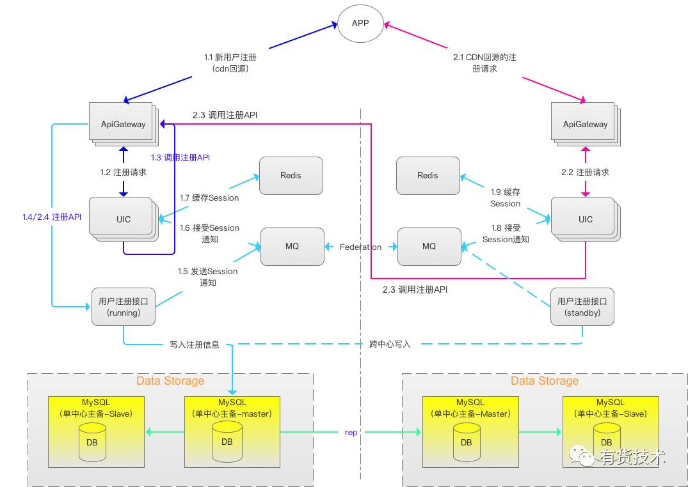
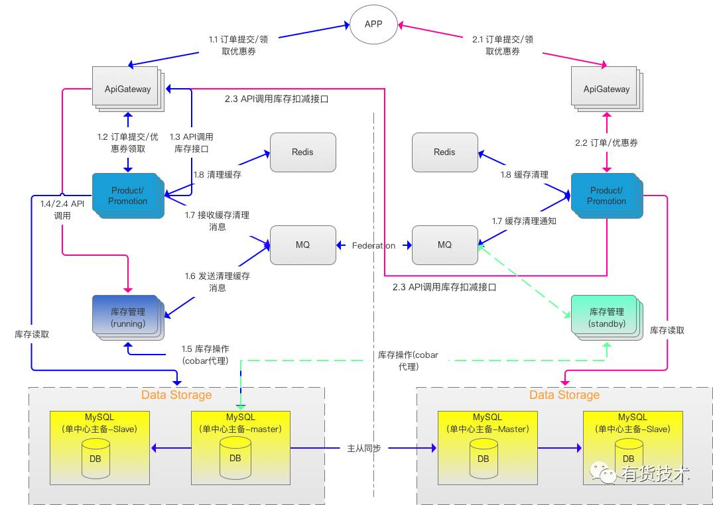

###容灾 级别, 衡量标准
按照容灾系统对应用系统的保护程度可以分为数据级容灾, 应用级容灾, 业务级容灾。
1. 数据级容灾
    1.仅将生产中心的数据复制到容灾中心，在生产中心出现故障时，仅能实现存储系统的接管或是数据的恢复。
    2.容灾中心的数据可以是本地生产数据的完全复制（一般在同城实现） ， 
    3.可以比生产数据略微落后，但必定是可用的（一般在异地实现） ， 
    4.而差异的数据可以通过一些工具（如操作记录、日志等）可以手工补回。
    5.基于数据容灾实现业务恢复的速度较慢,通常情况下RTO超过24小时
2. 应用级容灾
    1.对生产中心系统的基本复制
    2.容灾中心需要建立起一套和本地生产相当的备份环境，包括主机、网络、应用、 IP 等 资源均有配套
    3.RTO通常在12小时内
3. 业务级容灾 
    1.生产中心与容灾中心对业务请求同时进行处理的容灾方式，能够确保业务持续可用。
    2.业务恢复过程的自动化程度高， RTO可以做到30分钟以内 。 
    3.项目实施难度大,运维成本高， 需要从应用层对系统进行改造，比较适合流程固定简单业务系统 。 
     
- 衡量标准
1. RPO (Recovery-Point-Object ，灾难发生时允许丢失的数据量）
    这是一个灾备系统所选用的数据复制技术有密切关系的指标，用以衡量灾备方案的数据冗余备份能力。
2. RTO (Recovery-Time-Objective ，系统恢复的时间）
    包括备份数据恢复到可用状态所需时间、应用系统切换时间、以及备用网络切换时间等，该指标用以衡量容灾方案的业务恢复能力
3. ROI (Return-of-Investment ，容灾系统的投入产出比) 
4. 容灾半径（生产系统和容灾系统之间的距离）

### 常用数据复制技术
1. 数据复制可分为基于存储层的复制、基于主机层复制和基于应用的复制 。
2. 磁盘阵列 --> 存储网络 --> 卷管理软件 --> 文件系统 --> 数据库系统 --> 应用系统全部 
     数据复制就可以在这些流程的任一层次上实现
3. 基于存储层的复制
     可以是由存储设备的控制器执行，也可以是由网络层的虚拟化存储管理平台来执行，
     基于存储层的复制基于主机和应用的无关性，兼容性要求最低，实施难度最小，
     但是由于是卷级别的数据拷贝，对网络带宽要求最高； 
   基于主机的复制
     由安装在主机上的卷管理软件或是文件系统来实现，
     在实际的应用场景中，以基于卷管理软件的数据复制技术居多，这种方式通常要求主机平台相关，
     实施难度升高，但是带宽要求降低； 
   基于数据层的复制
     通过数据库的容灾功能模块来实现，
     对网络带宽要求最低，但是只能实现数据库数据的容灾；
   基于应用层的数据复制
     需要对应用程序进行定制开发，现实场景中很难见到。

### 几种主流的数据库容灾方案
- 基于存储磁盘的复制方案
    典型代表：EMC SRDF ，HDS Truecopy，IBM PPRC，
    方案优势：同步异步方式可供选择，数据同步过程不占用主机资源，带宽利用率高。
    方案限制：
       生产中心与灾备中心必须选择同品牌同级别的盘阵，将来的扩容也没有其他选择。
       数据同步过程中灾备中心处于standby状态，不能进行任何读写操作，即使使用高端盘阵也只能在灾难发生时才能发挥体会到其优越的处理能力，造成资源浪费。
       需要建立光纤网作为复制链路，又是一笔不小的费用。
       在存储级定制复制策略，无法在操作系统级控制和分辨复制内容，进行全盘复制，即使是一些不需要复制的文件也不能进行筛选，浪费带宽、浪费存储。    
- 基于卷的复制技术
    典型代表：Veritas Volume Replicator
    方案优势：
       IP网作为复制链路，成本低，不受距离限制，
       以卷作为复制对象，可以实现数据库和普通文件的容灾，支持异构存储。
    方案限制：
       需要复制的数据库和文件必须建立在Veritas Volume Manager之上，
       即使是已经上线的系统也必须要进行数据的迁移，可实施性差，相信没有人可以接受一个7x24运行的生产系统进行在线存储格式转换。
       复制过程在主机操作系统级实现，占用操作系统资源而且是不小的比例。
       为保证数据一致性，需要在生产中心维护复制log，发生的每一个I/O操作都要写复制一致性需要的log，所以很容易造成I/O性能瓶颈。
       如果出现线路故障导致堆积的log堆积过多出现空间溢出，生产中心和灾备中心只能进行完全同步。
       复制过程中灾备中心的数据库处于standy状态，不能进行任何读写，造成资源浪费。
- 基于数据库的复制
    典型代表：Oracle Data Guard。
    方案优势：
       灾备端处于Active状态，可进程正常的查询操作，提高硬件利用率。
       通过IP网实现数据复制，成本低，传输数据量小，带宽占用低。
       与数据库集成在一起，管理简单，数据库一致性得到很好保证，支持异构存储，距离不受限制。
       如果数据中心完全为Oracle环境，本人力推Active Data Guard作为数据库容灾方案的首选！
       低成本、易管理、高效率，其他方案只能望其项背。
    方案限制：
      只能进行Oracle的复制，对于其他数据库无能为力，对Oracle数据库的版本有要求。
- 总结：
     越是底层的复制，技术越简单，兼容性要求越低，但需要的带宽越大；反之；

### 双活/多活数据中心
1. 多个或两个数据中心都处于运行当中, 运行相同的应用，具备同样的数据，互为备份
提供跨中心业务负载均衡运行能力，实现持续的应用可用性和灾难备份能力 

1. 最大的特点是 ：
  1. 充分利用资源，避免了一个数据中心常年处于闲置状态而造成浪费,通过资源整合,双活数据中心的服务能力是翻倍的；  
  2. 如果断了一个数据中心，其业务可以迅速切换到另外一个正在运行的数据中心，切换过程对用户来说是不可感知的
  3. 一般来说，主数据中心的负载可能会多一些，比如分担60~70%的业务，备数据中心只分担40%~30%的业务。
2. 存在问题
  1. 脑裂问题
  
### 两地三中心(灾备中心正常情况下不提供服务)
两地三中心 ： 同城双中心 + 异地灾备 
两地 : 同城 + 异地；
三中心: 生产中心 + 同城容灾中心 + 异地容灾中心。

1. 生产中心 VS 同城容灾中心
     距离比较近，通信线路质量较好，比较容易实现数据的同步复制，保证高度的数据完整性和数据零丢失。
     同城容灾中心主要是用于防范生产服务器发生的故障，
2. 生产中心 VS 异地容灾中心
     距离较远，因此一般采用异步镜像，会有少量的数据丢失
     异地容灾中心用于防范大规模区域性灾难
     
### [有货双活数据中心实战](https://www.cnblogs.com/qingfengEthan/p/12611005.html)
- 关键点
1.用户信息、订单、优惠券相关数据库、表实现数据库拆分，实现用户登录、浏览、购物车、下单等核心流程在本中心内完成。
2.非关键业务使用数据库跨中心主备方式，从中心通过专线跨中心写入。
3.双中心间通过rabbitmq的Fedration插件实现消息跨中心复制，实现业务层跨中心数据同步(用户session、订阅、收藏等数据)。

1. 
  1.1 只用一个数据中心服务，另一个保持热备状态。
  1.2 当热备状态的中心接受注册请求时，调用rpc请求。
2. 
  2.1 库存服务目前为商品库存、优惠券领取数量，由于涉及原子操作，
    双中心拆分实现在当前优势不明显，目前暂时使用主中心写入，再同步到从中心方案。
    只用一个数据中心服务，另一个保持热备状态，使用rpc请求。
3. 
   推荐服务不进行双中心部署
   实时推荐数据通过MQ Federation机制将推荐数据发到两个中心，前台推荐服务接收到消息后，将消息缓存到redis。
   离线推荐数据在凌晨计算完成后直接写入本中心redis，然后通过脚本同步到另一中心。